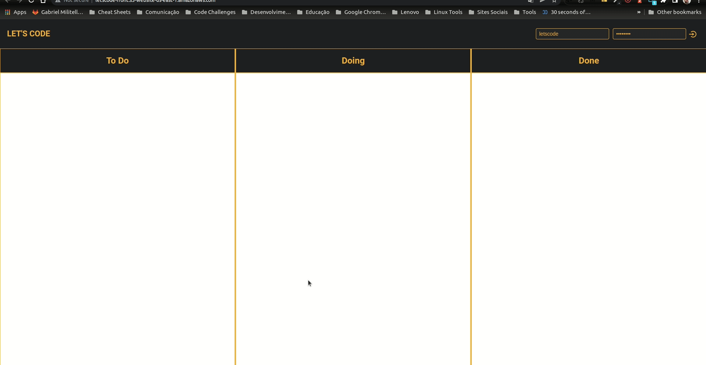

# Let's Code - Frontend

Esse repostório contém a solução para o desafio de frontend proposto pela Let's Code.

O repositório do desafio: https://gitlab.com/gabriel.militello1/desafio-tecnico-frontend

O projeto consiste em um painel de tarefas, onde é possível organizar as atividades em três rais (To Do, Doing e Done).
É possível também criar novas tasks, remover e alterá-las conforme necessidade.

Para que seja possível realizar qualquer atividade no painel, é necessário realizar o login utilizando as seguintes credenciais:

- user: letscode
- password: lets@123

# Tecnologias e bibliotecas utilizadas

- Javascript
- Typescript => https://www.typescriptlang.org/
- ReactJS => https://pt-br.reactjs.org/
- Styled Components => https://styled-components.com/
- Styled Icons => https://styled-icons.dev/
- Style Media Query => https://www.npmjs.com/package/styled-media-query
- Polished => https://polished.js.org/
- Axios => https://axios-http.com/ptbr/
- Jest => https://jestjs.io/pt-BR/
- Testing Library => https://testing-library.com/
- Mock Service Worker => https://mswjs.io/
- ESLint => https://eslint.org/
- Prettier => https://prettier.io/
- Lint Staged => https://www.npmjs.com/package/lint-staged
- Commitizen => https://commitizen-tools.github.io/commitizen/
- Webpack => https://webpack.js.org/

# Pré requisitos para execução do projeto

- NodeJS instalado na máquina
- Baixar o repositório (https://gitlab.com/gabriel.militello1/desafio-tecnico-frontend) e iniciar o servidor node existente na pasta "BACK" (seguir as orientações do readme para iniciar o backend)

# Executando o projeto

- Clonar esse projeto em sua máquina
- Entrar na pasta criada e rodar o comando:

```script
yarn
```

- Garantir que o "Backend" esteja rodando em sua máquina (http://localhost:5000)
- Inciar a aplicação front com o seguinte comando:

```script
yarn dev
```

A aplicação deve ser iniciada e carregada automaticamente no seu navegador padrão

# Demonstração básica de uso

Você pode acessar uma versão funcional da aplicação no seguinte endereço:

http://letscode-front.s3-website-us-east-1.amazonaws.com/


